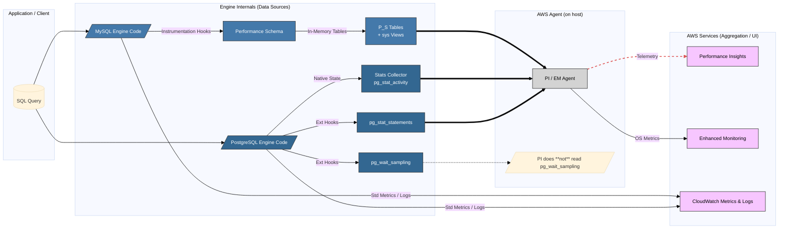
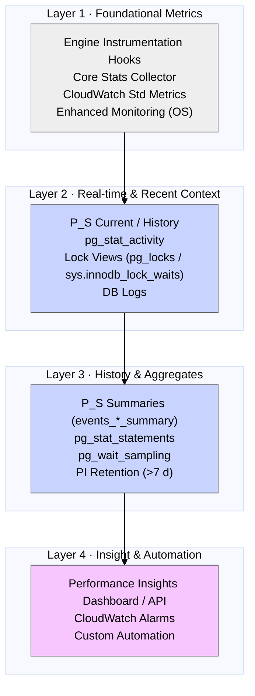

# Database Observability · Architecture & Physics
### MySQL Performance Schema vs PostgreSQL Toolkit on AWS RDS / Aurora  
*Version 2024-Q3 · MySQL 8.0 / Aurora MySQL 3.x · PostgreSQL 15 / Aurora PG 15.x*

---

> **Audience:** Senior DBAs, SREs, DevOps needing actionable insights for AWS databases under pressure.  
> **Goal:** Explain the *physics* behind the metrics for trust, prediction, and rapid diagnostics (< 60 s probe selection).

---

## 🧭 Visual Index
* [1. Signal Path & Architecture](#1--end-to-end-signal-path--architecture-overlay)
* [2. Observability Physics Laws](#2--six-laws-of-observability-physics-engine-fundamentals)
* [3. Observability Spectrum Quadrant](#3--observability-spectrum-depth-vs-ease)
* [4. Capability Layer Cake](#4--layered-capability-model)
* [5. Capability Heat-Map & Blind-Spots](#5--capability--blind-spot-heat-map)
* [6. Resource Guardrails](#6--resource-guardrails--overhead-budgeting)
* [7. First-Five Diagnostic Probes](#7--first-five-probes--sev-1-start)
* [8. Workload-Optimized Templates](#8--workload-optimized-config-templates)
* [9. Top Anti-Patterns & Fixes](#9--top-5-anti-patterns--fixes)
* [10. Strategic Rules of Thumb](#10--strategic-rules-of-thumb)

---

## 1 · End-to-End Signal Path & Architecture Overlay
How engine events become Performance Insights (PI) data points.



<details open>
<summary><b>Legend</b></summary>

| Line / Box                                                                                          | Meaning                          |
| --------------------------------------------------------------------------------------------------- | -------------------------------- |
| **Solid Arrow ==>**                                                                                 | Data sampled/queried by PI agent |
| **Dashed Arrow -.->**                                                                               | Data the agent ignores           |
| <span style="background:#4479AA;color:#fff;padding:2px 6px;border-radius:3px">MySQL box</span>      | MySQL-specific                   |
| <span style="background:#336791;color:#fff;padding:2px 6px;border-radius:3px">PostgreSQL box</span> | PostgreSQL-specific              |
| <span style="background:#d3d3d3;padding:2px 6px;border-radius:3px">Grey box</span>                  | AWS-managed agent                |
| <span style="background:#f7c6ff;padding:2px 6px;border-radius:3px">Pink box</span>                  | AWS aggregation / UI             |

</details>

**Quick Truths**

* **Single-bus vs Modular:** MySQL pipes everything through P\_S; Postgres scatters data across views & extensions.
* **Agent Blind-spot:** PI never queries `pg_wait_sampling`; query it yourself for deep wait history.
* **Corollary:** If PI feels "shallower" on PG for waits, it is – physics, not UI.

---

## 2 · Six Laws of Observability Physics (Engine Fundamentals)

| # | Law             | MySQL P\_S Fact                                 | PostgreSQL Toolkit Fact                          | Ops Rule                                                           |
| - | --------------- | ----------------------------------------------- | ------------------------------------------------ | ------------------------------------------------------------------ |
| 1 | Hook Density    | Instrumented (\~2k+ code points)                | ≈ 250 core counters + extension hooks + sampling | More hooks ⇒ deeper insight **and** more overhead risk.            |
| 2 | Time Resolution | Nanosecond timers                               | Millisecond (views) / Microsecond (sampling)     | < 1 ms waits visible only in MySQL P\_S.                           |
| 3 | Context Chain   | Linked events (`THREAD_ID`, `NESTING_EVENT_ID`) | Disconnected snapshots / aggregates              | MySQL traces causality; PG needs manual correlation.               |
| 4 | Memory Topology | Pre-allocated fixed buffers                     | Dynamic shared-memory segments                   | MySQL: size right or lose data (`*_lost`). PG may evict LRU data.  |
| 5 | Wait Taxonomy   | ≈ 300 hierarchical names                        | ≈ 40 flat names                                  | PG waits coarser in PI; use `pg_wait_sampling` for detail.         |
| 6 | Overhead Curve  | O(events × enabled instruments)                 | O(query-rate + sample-rate)                      | MySQL overhead driven by *what* you enable; PG by *workload rate*. |

---

## 3 · Observability Spectrum: Depth vs Ease (AWS Context)

```
Depth / Granularity
      ▲
      │                   ┌───────────────────────────────────┐
      │                   │           LOW EASE                │
      │                   │           HIGH DEPTH              │
      │                   │                                   │
      │     pg_stat_monitor ●                                 │
High  │                   │     ● MySQL P_S Raw Tables        │
      │                   │                                   │
      │                   │        ● MySQL sys Schema         │
      │                   │                                   │
      │                   │          ● pg_wait_sampling       │
      │                   └───────────────────────────────────┘
      │                                             ● PI for MySQL
      │                   ┌───────────────────────────────────┐
      │                   │                         ● pg_stat_statements 
      │                   │                                   │
      │                   │                       ● PI for PostgreSQL
      │                   │                                   │
      │                   │                                   │
Low   │                   │           LOW EASE                │
      │                   │           LOW DEPTH          ● pg_stat_activity
      │                   │                                   │
      │                   │                                   │
      │                   │               ● CloudWatch Basic Metrics
      │                   └───────────────────────────────────┘
      └───────────────────────────────────────────────────────────▶
        Low                         Ease of Setup / Use           High
```

**Insight:** PI boosts ease-of-use. MySQL + PI still reaches greater native depth (esp. waits). Deep PG visibility needs extra tools like `pg_wait_sampling`.

---

## 4 · Layered Capability Model



**Insight:** Troubleshooting often walks *up* these layers: PI → Aggregates → Real-time → Engine hooks/OS.

---

## 5 · Capability & Blind-Spot Heat-Map

Visualize coverage depth across key dimensions. (Depth: ▏=Basic ▍=Fair ▋=Good █=Excellent ❌=Missing)

| Dimension | MySQL (P_S + PI) | PostgreSQL (Toolkit¹⁾ + PI) | Blind-Spot / AWS Limitation / Note |
|-----------|------------------|----------------------------|-------------------------------------|
| SQL Latency (Avg/P95) | █████ | █████ | — |
| SQL Execution Stages | █████ | ❌ | PG needs logging (auto_explain). PI doesn't show stages. |
| Wait Event Breakdown | █████ | ▋▍░░░ | PG PI waits are coarse. Use pg_wait_sampling directly for better PG wait history. |
| Lock Contention Chain | ████▋ | ████▋ | Historical lock graphs weak. Needs live views (sys.innodb_lock_waits, pg_locks) or sampling/logging. |
| Memory Internals | ████▋ | ▏░░░░ | PG needs OS/EM metrics + non-standard extensions (pg_buffercache). PI lacks memory breakdown. |
| File/Object I/O | █████ | ▋▍░░░ | PG pg_statio_* good but lacks P_S file-level granularity. PI I/O waits lack object context. |
| Query Plan History | ❌ | ❌ | Requires external tools/logging. pg_stat_monitor N/A on RDS/Aurora. |
| Literal SQL Params | ❌ | ❌ | Security risk. Use logs or app tracing if essential. pg_stat_monitor N/A. |

¹⁾ Toolkit = pg_stat_activity + pg_stat_statements + pg_wait_sampling.

---

## 6 · Resource Guardrails ⚖️: Quick Overhead Budgeting

Estimate before enabling! Use CloudWatch/EM to verify post-change.

| Engine / Component | RAM Budget Estimate¹⁾ | CPU Budget (% vCPU)²⁾ | Notes |
|--------------------|---------------------|----------------------|--------|
| MySQL P_S (Base) | ~40MB + (Digests * ~1KB) | ~1-3% (PI Auto) | Memory is pre-allocated. Ensure FreeableMemory buffer. |
| MySQL P_S (Heavy) | Base + History Size * Entries * ~Size | ~3-7%+ | Tune consumers/instruments; avoid full history on small instances. |
| PG pg_stat_statements | ~150 Bytes * max | ~1-2% | Very lightweight. |
| PG pg_wait_sampling | Few MB Base + History Samples | ~2-5%+ (Queries OFF)<br>~5-10%+ (Queries ON) | Monitor CPU closely! Sensitive to profile_period, queries flag. |

¹⁾ Rough estimates. P_S digests_size, PG pg_stat_statements.max. P_S History RAM complex.
²⁾ Typical % increase relative to baseline CPU. Highly workload dependent.

**Safety Rule:** Aim for < 5-7% total additional CPU overhead. Keep P_S RAM < 10-15% FreeableMemory. Test under representative load.

---

## 7 · First-Five Probes ⚡: Your < 60 Second Diagnostic Start

(Copy-paste these blocks directly into your shell)

**Current High-Load Sessions & Waits:**

```sql
-- MySQL:
SELECT p.ID, p.USER, p.HOST, p.DB, p.COMMAND, p.TIME, p.STATE AS SQL_STATE, 
       LEFT(p.INFO, 80) AS INFO, th.PROCESSLIST_STATE AS THREAD_STATE, 
       LEFT(th.CURRENT_WAIT_EVENT, 60) AS WAIT_EVENT 
FROM information_schema.PROCESSLIST p 
JOIN performance_schema.threads th ON p.ID = th.PROCESSLIST_ID 
WHERE p.COMMAND != 'Sleep' 
ORDER BY p.TIME DESC LIMIT 10;
```

```sql
-- PostgreSQL:
SELECT pid, usename, application_name, client_addr, state, wait_event_type, wait_event, 
       now() - state_change AS state_duration, now() - query_start AS query_duration, 
       left(query, 100) AS query_snippet 
FROM pg_stat_activity 
WHERE state <> 'idle' AND pid <> pg_backend_pid() 
ORDER BY query_start ASC LIMIT 10;
```

**Top SQL by Total Time (Since Reset/Restart):**

```sql
-- MySQL (sys schema):
SELECT query, exec_count, FORMAT_PICO_TIME(total_latency) AS total_time, 
       FORMAT_PICO_TIME(avg_latency) AS avg_time, FORMAT_PICO_TIME(lock_latency) AS lock_time 
FROM sys.statement_analysis 
ORDER BY total_latency DESC LIMIT 5;
```

```sql
-- PostgreSQL:
SELECT queryid, calls, round(total_exec_time::numeric/1000, 2) AS total_sec, 
       round(mean_exec_time::numeric, 2) AS avg_ms, rows, query 
FROM pg_stat_statements 
ORDER BY total_exec_time DESC LIMIT 5;
```

**Top Wait Events (Historical Aggregate):**

```sql
-- MySQL (sys schema):
SELECT event_name, total, FORMAT_PICO_TIME(total_latency) AS total_time_waited 
FROM sys.waits_global_by_latency LIMIT 5;
```

```sql
-- PostgreSQL (needs pg_wait_sampling):
SELECT wait_event, SUM(total_time_ms)/1000 AS total_sec 
FROM pg_wait_profile 
GROUP BY wait_event 
ORDER BY total_sec DESC LIMIT 5;
```

**Current Blocking Locks:**

```sql
-- MySQL (sys schema): 
SELECT * FROM sys.innodb_lock_waits;
```

```sql
-- PostgreSQL:
SELECT blocked_locks.pid AS blocked_pid, blocked_activity.usename AS blocked_user, 
       left(blocked_activity.query, 60) AS blocked_query, blocking_locks.pid AS blocking_pid, 
       blocking_activity.usename AS blocking_user, left(blocking_activity.query, 60) AS blocking_query 
FROM pg_catalog.pg_locks blocked_locks 
JOIN pg_catalog.pg_stat_activity blocked_activity ON blocked_locks.pid = blocked_activity.pid 
JOIN pg_catalog.pg_locks blocking_locks 
  ON blocking_locks.locktype = blocked_locks.locktype 
  AND blocking_locks.DATABASE IS NOT DISTINCT FROM blocked_locks.DATABASE 
  AND blocking_locks.relation IS NOT DISTINCT FROM blocked_locks.relation 
  AND blocking_locks.page IS NOT DISTINCT FROM blocked_locks.page 
  AND blocking_locks.tuple IS NOT DISTINCT FROM blocked_locks.tuple 
  AND blocking_locks.virtualxid IS NOT DISTINCT FROM blocked_locks.virtualxid 
  AND blocking_locks.transactionid IS NOT DISTINCT FROM blocked_locks.transactionid 
  AND blocking_locks.classid IS NOT DISTINCT FROM blocked_locks.classid 
  AND blocking_locks.objid IS NOT DISTINCT FROM blocked_locks.objid 
  AND blocking_locks.objsubid IS NOT DISTINCT FROM blocked_locks.objsubid 
  AND blocking_locks.pid != blocked_locks.pid 
JOIN pg_catalog.pg_stat_activity blocking_activity ON blocking_locks.pid = blocking_activity.pid 
WHERE NOT blocked_locks.granted;
```

**Check Engine Health / Limits / Config:**

```sql
-- MySQL:
SHOW GLOBAL STATUS LIKE 'Performance_schema_%_lost'; 
SHOW GLOBAL VARIABLES LIKE 'max_connections'; 
SELECT count(*) FROM information_schema.PROCESSLIST; 
SHOW GLOBAL VARIABLES LIKE 'performance_schema';
```

```sql
-- PostgreSQL:
SELECT current_setting('max_connections'); 
SELECT count(*) FROM pg_stat_activity; 
SHOW shared_preload_libraries; 
SHOW track_activity_query_size; 
SELECT extname FROM pg_extension WHERE extname IN ('pg_stat_statements', 'pg_wait_sampling');
```

---

## 8 · Workload-Optimized Config Templates (Parameter Group Settings)

| Pattern | MySQL Snippet (Parameter Group) | PostgreSQL Snippet (Parameter Group) | Rationale |
|---------|--------------------------------|-------------------------------------|-----------|
| High TPS | performance_schema=ON<br>performance_schema_digests_size=20000 <!-- 🚨 Reboot --> | shared_preload_libraries='pg_stat_statements,pg_wait_sampling'<!-- 🚨 Reboot --><br>track_activity_query_size=8192<!-- 🚨 Reboot --><br>pg_wait_sampling.profile_period=10 | Prioritize waits & locks, handle high digest cardinality, balance sampling detail/overhead. |
| OLAP / BI | performance_schema=ON<br>performance_schema_max_sql_text_length=16384<!-- 🚨 Reboot --><br>max_digest_length=8192<!-- 🚨 Reboot --> | shared_preload_libraries='pg_stat_statements'<!-- 🚨 Reboot --><br>track_activity_query_size=16384<!-- 🚨 Reboot --><br>pg_stat_statements.track_planning=on | Capture long queries accurately, track planning time, waits less critical. |
| t3/t4g Micro | performance_schema=OFF <!-- 🚨 Reboot --> (Use PI Fallback) | shared_preload_libraries='pg_stat_statements'<!-- 🚨 Reboot --><br>track_activity_query_size=4096<!-- 🚨 Reboot --><br>pg_stat_statements.max=2000 | Minimize RAM/CPU overhead; accept reduced visibility. Avoid PG wait sampling. |

Parameter Group changes involving static parameters or shared_preload_libraries require an instance Reboot 🚨.

---

## 9 · Top-5 Anti-patterns & Fixes

| Anti-pattern | Why it Hurts | Quick Fix ✅ / Link 🔗 |
|--------------|--------------|------------------|
| 1. Forgetting CREATE EXTENSION pg_stat_statements per DB (PG) | PI Top SQL remains empty or incomplete for those DBs. | ✅ Connect & CREATE EXTENSION. [See Architecture Overlay](#1--end-to-end-signal-path--architecture-overlay) |
| 2. Leaving track_activity_query_size at default 1024 (PG) | SQL text truncated everywhere (activity, statements, PI), hindering analysis. | ✅ Increase to >= 4096 (8192+ rec.) in PG & Reboot 🚨. [See Physics Laws](#2--six-laws-of-observability-physics-engine-fundamentals) |
| 3. Enabling pg_wait_sampling.profile_queries=ON always (PG) | Significant CPU overhead (~+5-10%+) due to constant lookup/correlation. | ✅ Keep OFF by default. Enable temporarily only for deep dives. [See Resource Guardrails](#6--resource-guardrails--overhead-budgeting) |
| 4. Hitting P_S digest_lost > 0 (MySQL) | New/infrequent query patterns aren't tracked; PI Top SQL becomes inaccurate. | ✅ Increase performance_schema_digests_size in PG & Reboot 🚨. [See Resource Guardrails](#6--resource-guardrails--overhead-budgeting) |
| 5. Assuming PI Wait Events (PG) == P_S Wait Events (MySQL) Granularity | Leads to misdiagnosis; PG waits are coarser, lack deep internal context. | ✅ Understand the difference (Law #5). Use pg_wait_sampling direct queries for PG wait history. [See Physics Laws](#2--six-laws-of-observability-physics-engine-fundamentals) |

---

## 10 · Strategic Rules of Thumb

* **PI First, Engine Deep Dive Second:** Use PI's dashboard to identify where (Waits vs SQL, which ones?). Use engine tools (sys/P_S, activity/statements/sampling) to understand why and get specifics.

* **Know Your Physics:** Understand instrumentation vs. sampling differences and the wait granularity gap to interpret data correctly. Match tool to diagnostic need.

* **Master Prerequisites & Reboots:** Ensure P_S is ON (MySQL) and pg_stat_statements + track_activity_query_size are correct (PG) for PI. Plan required reboots 🚨.

* **Layer Intelligently:** Combine PI, engine tools, Enhanced Monitoring (OS stats), and application logs for a holistic view. Add pg_wait_sampling for better PG wait history.

* **Measure & Automate:** Establish baseline overhead. Automate checks for config drift (*_lost, query size, extension status) to prevent silent monitoring failures.
