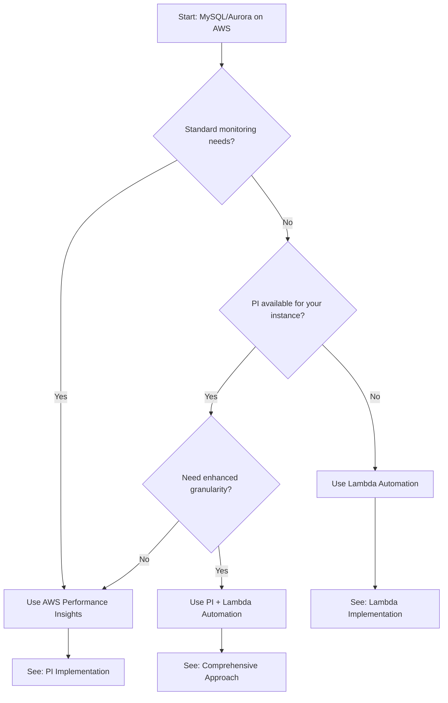

# MySQL Monitoring Strategy: Performance Insights vs. Lambda Automation

## Decision Tree: Choosing the Right Approach

| Requirement | Recommended Approach |
|-------------|---------------------|
| **Standard monitoring needs** | Start with **AWS Performance Insights** (PI) as primary solution |
| **PI not available** or **Enhanced granularity needed** | Use **Lambda Automation** approach |
| **Very large or complex workloads** | Use **PI + Parameter Group + Lambda** for comprehensive coverage |

> **New for 2025**: For most MySQL on AWS deployments, Performance Insights provides the simplest path to effective monitoring with minimal overhead. The Lambda automation approach should be considered complementary for specialized use cases.

## Introduction

This guide helps you optimize MySQL monitoring on AWS RDS and Aurora using New Relic, with a primary focus on leveraging AWS Performance Insights (PI) complemented by targeted Performance Schema (P_S) configurations where needed.

### The Challenge of Database Monitoring

Effective database monitoring provides critical performance insights, but improper configuration can:

1. **Generate excessive data volume** - increasing New Relic ingest costs
2. **Consume unnecessary system resources** - adding significant CPU overhead
3. **Create monitoring noise** - making it harder to identify real issues
4. **Reset consumer & instrument rows after restarts/failovers** - causing inconsistent observability (parameter group variables persist)

### Key Benefits of Our Recommended Approach

* **Reduced costs** - Lower New Relic data ingest volume (typically 40-70% savings)
* **Improved performance** - Typically adds less than 5% CPU overhead
* **Focused monitoring** - Capture only metrics that drive actionable insights
* **Consistent visibility** - AWS-managed configuration ensures persistent monitoring
* **Simplified management** - Let AWS do the heavy lifting via Performance Insights

## Primary Recommendation: Let AWS Do the Heavy Lifting

Our primary recommendation for 2025 is to leverage AWS Performance Insights (PI) as your foundation for monitoring MySQL/Aurora databases. Performance Insights:

- Automatically enables and configures core Performance Schema components
- Maintains configuration through instance restarts and failovers
- Provides comprehensive monitoring with minimal overhead
- Delivers persistent visibility without manual intervention

For a complete guide to implementing this approach, see our [Implementation Guide](02-implementation.md).

## Supplemental Performance Schema Configuration

While Performance Insights handles the core configuration, you may want to supplement it with these settings for optimal New Relic integration:

### 1. Supplemental Parameter Group Settings

| Parameter | Recommended Value | Notes |
|-----------|-------------------|-------|
| `performance_schema` | `1` (ON) | Usually managed by PI, but ensure it's explicitly enabled |
| `performance_schema_digests_size` | `10000` | Ensures adequate memory for query digest storage |
| `performance_schema_max_sql_text_length` | `4096` | Capture full query text for better identification |
| `performance_schema_events_statements_history_long_size` | `10000` | Sufficient history for New Relic's longer-term analysis |

### 2. When to Consider Lambda Automation

The Lambda automation approach is most valuable when:

1. **Performance Insights isn't available** for your instance type or region
2. **You need specific instrumentation** that PI doesn't enable automatically
3. **You require custom configurations** that must persist through restarts
4. **You manage many databases** and need consistent, automated configuration

## Implementation Options

For modern MySQL monitoring on AWS in 2025, we recommend this approach:

1. **Primary Layer**: AWS Performance Insights (managed Performance Schema)
2. **Supplemental Layer**: Parameter Group adjustments for buffer sizes and specialized settings
3. **Optional Layer**: Targeted SQL configuration for specialized monitoring needs

Depending on your requirements, you can implement:

**Option A (Recommended): Performance Insights + Parameter Group**
- Enable Performance Insights for automatic Performance Schema management
- Apply supplemental Parameter Group settings for optimization
- Use New Relic's extended Performance Schema metrics

**Option B: Fully Automated Performance Schema Management**
Only necessary if Performance Insights doesn't meet your needs or isn't available:
- Complete Parameter Group configuration 
- Lambda + EventBridge automation for runtime settings
- Scheduled verification and maintenance

See our [Implementation Guide](02-implementation.md) for detailed instructions on both approaches.

## Next Steps

1. Determine which approach best fits your requirements using the decision tree above
2. Follow the [Implementation Guide](02-implementation.md) for step-by-step instructions
3. Consult the [Troubleshooting Guide](03-troubleshooting.md) if you encounter any issues

---

© New Relic, Inc. | Internal use and authorized customers only
