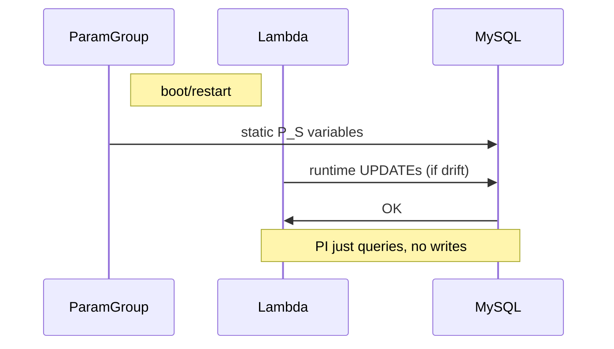

# Performance Insights and Lambda Automation Coexistence

## 1. How PI talks to performance_schema
PI must read several P_S tables to calculate DB load, so when you enable it the service can also write to setup_consumers and setup_instruments. AWS calls this automatic management — PI flips on the consumers/instruments it needs and sometimes turns off ones it thinks are too noisy. MySQL versions ≥5.7 and all Aurora-MySQL variants are supported.

Whether PI actually takes that control depends on three runtime checks AWS documents:

| Check | Effect |
|-------|--------|
| Parameter performance_schema = 0 (or not set by user) | PI turns P_S on and manages it |
| Parameter performance_schema = 1 set by user | PI assumes Manual mode and does not change settings |
| DB engine version / instance class (e.g., db.t4g.medium) that lacks enough RAM | PI refuses to manage P_S; you must do it |

These rules are in the "Automatic vs. manual management" table in the PI docs and the follow-up "Determining whether Performance Insights is managing the Performance Schema" section.

## 2. Option A — Put PI in Manual mode and let Lambda own P_S (recommended)

### 2.1 Enable Manual mode
**Console** – when you enable or modify PI you'll see Manage performance-schema; choose Manual.

**CLI / IaC** – keep PI enabled but make sure the parameter group attached to the instance sets:

```
performance_schema = 1   (Source = user)
```

PI will detect that user override and stay passive.

### 2.2 What this means

| Aspect | Result |
|--------|--------|
| Authority | Parameter Group + Lambda target-config.yaml are the only writers |
| Predictability | High – Lambda drift logic is deterministic |
| Overhead control | You decide exactly which waits/stages/statements stay on |
| User burden | You must leave all instruments PI needs (statement digests, wait/io/* etc.) enabled or PI graphs go blank |

A disciplined workflow is:



### 2.3 Checklist
✅ Confirm performance_schema is 1 in the parameter group and Source=user

✅ In target-config.yaml include:
- events_statements_current, statements_digest, plus any consumers PI relies on (doc's "Required consumers" list)

✅ Enable Lambda alarms (DriftDetected, ErrorDetected) already present in the CloudFormation/Terraform code

✅ After a reboot run sql/verification.sql – no "ERROR" rows should appear

## 3. Option B — Leave PI in Automatic mode and make Lambda "compatible"

### 3.1 Identify the PI-managed set
AWS publishes an indicative list of what PI toggles (statement digests, waits on most InnoDB I/O, thread instrumentation, etc.) but notes it may change with engine versions.

Best practice to discover the live set:

```sql
-- Snapshot just after enabling PI, before Lambda runs
SELECT NAME, ENABLED
FROM performance_schema.setup_consumers
WHERE ENABLED='YES';
```

### 3.2 Craft a non-overlapping target-config.yaml
Don't include PI's consumers/instruments in the enabled list unless your value matches PI's.

Use the Lambda mainly to disable known-noisy groups that PI leaves on (e.g., wait/sync/%) or to add fringe instruments PI ignores (example: new MySQL 8.0.34 lock metadata events).

Never disable events_statements_* or the PI digest instruments; PI may flip them back on every minute, causing "flapping."

### 3.3 Pros & Cons

#### Auto Mode + Compatible Lambda
- **Setup effort**: Slightly lower (PI chooses defaults)
- **Stability**: Medium–low: if AWS updates PI logic, overlap may appear
- **Observability**: Good if your compatible set is accurate; risky otherwise
- **Typical issue**: CloudWatch shows drift every few minutes → high Lambda invocations

## 4. Decision matrix

| Requirement | Safer Choice |
|-------------|--------------|
| You need deterministic P_S state, lowest overhead | Manual mode + Lambda |
| You're OK with PI defaults and only want to disable a few extras | Auto mode + compatible Lambda |
| Limited Ops staff, want AWS to handle most knobs | Auto mode (no Lambda at all) |

## 5. Implementation cheat-sheet (copy/paste)

### Manual mode
```bash
aws rds modify-db-instance \
  --db-instance-identifier $DB \
  --enable-performance-insights \
  --apply-immediately

# attach PG that sets performance_schema=1 (user)
```

### Auto mode with compatible Lambda
```yaml
# target-config.yaml  (minimal example)
consumers_enabled:
  - events_statements_current   # PI already ON – same value so safe
instruments_disabled_prefixes:
  - wait/sync/%                 # PI leaves these noisy waits ON
```

Monitor DriftDetected metric; if it spikes, review overlap list again.

## 6. Additional reading & references

- AWS doc "Automatic vs. manual management of the Performance Schema" – table of behaviour
- AWS doc "When Performance Insights manages the Performance Schema automatically" – edge cases like db.t4g.* classes
- AWS doc "Determining whether Performance Insights is managing the Performance Schema" – quick SQL tests and CloudWatch log clues
- AWS Database Blog "Get the most out of MySQL shear throughput with Performance Insights" – shows how PI relies on P_S digests
- Search results confirming PI/P_S interaction across engine families

Keep those guidelines close when you roll the stack – they'll save you from chasing ghosts caused by two automated systems arguing over the same knobs.
